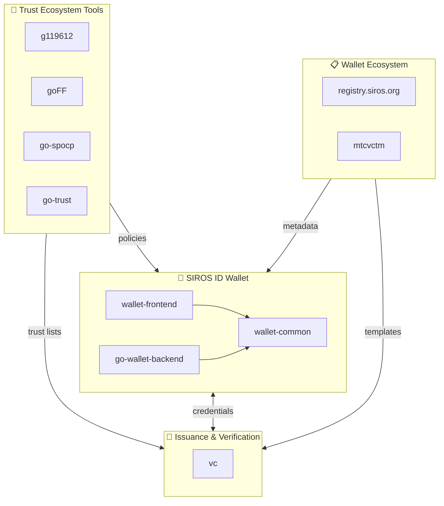

## SIROS Foundation

SIROS Foundation builds open source for digital identity. What you will find here includes...

* SIROS ID - our EUDI wallet ([wallet-frontend](https://github.com/sirosfoundation/wallet-frontend), [wallet-common](https://github.com/sirosfoundation/wallet-common) and [go-wallet-backend](https://github.com/sirosfoundation/go-wallet-backend))
* Our downstream of [SUNET/vc](https://github.com/SUNET/vc) - the issuer/verifier used in SIROS ID
* Tools to help you build and maintain trust ecosystems ([g119612](https://github.com/sirosfoundation/g119612), [goFF](https://github.com/sirosfoundation/goFF), [go-spocp](https://github.com/sirosfoundation/go-spocp), [go-trust](https://github.com/sirosfoundation/go-trust)) 
* Tools for building and maintaining a wallet ecosystem ([registry.siros.org](https://github.com/sirosfoundation/registry.siros.org), [mtcvctm](https://github.com/sirosfoundation/mtcvctm), ...)
* And many other things

Read about SIROS ID at [developers.siros.org](https://developers.siros.org) and about SIROS Foundation at [siros.org](https://siros.org)

